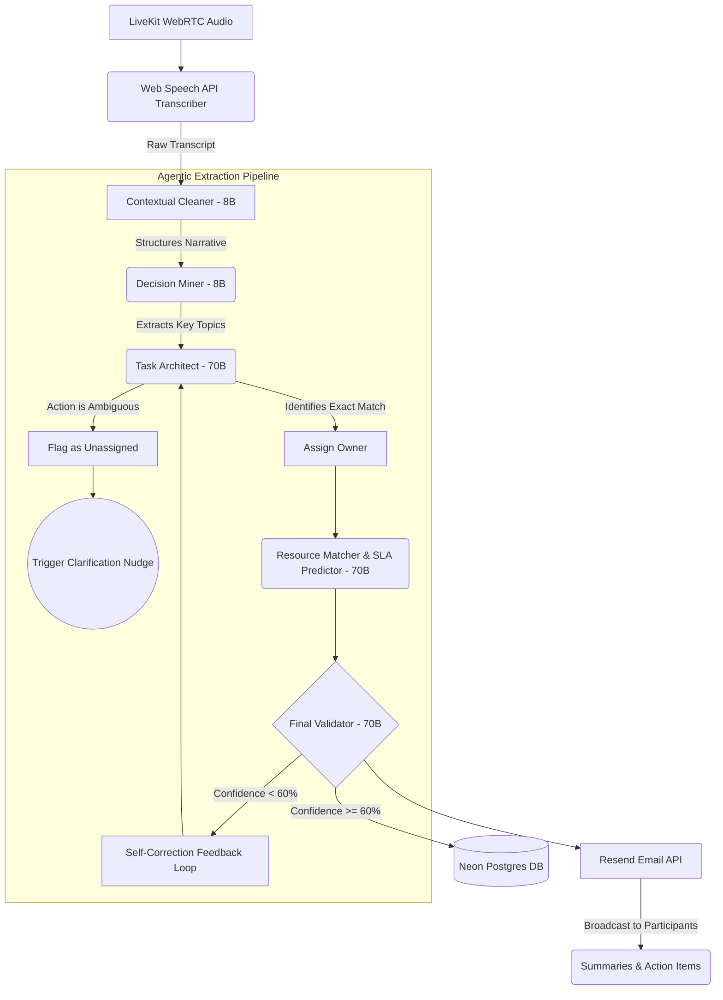
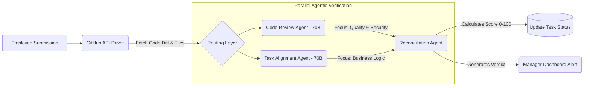

# WorkSync AI: Architecture & Impact Model
**Hackathon Category:** Autonomous Enterprise Workflows
**Objective:** Zero-Input Administrative Orchestration & Performance Verification

---

## 1. System Architecture & Multi-Agent Design
WorkSync AI is built on a modular **Multi-Agent Orchestration Layer** rather than a single monolithic LLM prompt. This allows for clear separation of concerns, specialized tool integrations, and strict error-handling guardrails.

### A. The "Meeting to Action" Orchestration Pipeline
This pipeline runs synchronously after a meeting concludes. It handles contextual memory, extraction, and automated downstream distribution.

### B. The "Execute to Evaluate" Verification Pipeline
This pipeline operates asynchronously. When an employee submits a task with a GitHub Pull Request, the system synthetically verifies completion without managerial intervention.

---

## 2. Agent Roles & Communication
By routing computationally inexpensive tasks to small models and reasoning tasks to large models, we achieve **Cost Efficiency** without degrading output quality.

| Agent Name | Model Routing | Core Responsibility & Communication Pattern |
| :--- | :--- | :--- |
| **Contextual Cleaner** | Llama 3.3 (8B) | Cleans noise from live WebRTC transcripts. Feeds sanitized text directly to the Decision Miner. |
| **Task Architect** | Llama 3.3 (70B) | Translates decisions into rigid JSON engineering tasks. Handles missing assignments by branching to a *Clarification Routine* rather than hallucinating an owner. |
| **Final Validator** | Llama 3.3 (70B) | Cross-audits extracted task arrays against the raw transcript. If confidence is low, it halts DB insertion and communicates feedback backwards to the Task Architect. |
| **Reconciliation Agent**| Llama 3.3 (70B) | Acts as the "Executive Decider." It consumes the conflicting opinions of parallel PR Code Reviewers and outputs a cohesive pass/fail verdict for the manager's dashboard. |
| **Follow-up / SLA Agent**| Llama 3.3 (70B) | Triggers on a Vercel Cron. Analyzes historic velocity vs active workload, predicting bottlenecks and communicating via direct proactive email nudges. |

---

## 3. Enterprise Readiness & Error Handling
- **Database Resilience:** Neon Serverless edge endpoints are wrapped in a 5-retry exponential backoff function (`postgres.js`) to gracefully weather cold-start connection timeouts.
- **Immutable Audit Trail:** Actions are completely deterministic. Every agent saves its reasoning, input, output, duration limit, and confidence score to an `AgentDecisionLog` table for management auditing.
- **Graceful Degradation:** The Web Speech transcription engine uses a custom restart-lock mutex guard to silently capture interrupted data without throwing browser `InvalidStateErrors` on patchy connections.

---

## 4. Impact Model: Business ROI & Quantification
We built our Business Impact model based on typical SaaS/Agency deployment scenarios. By eliminating the "Admin Tax" and closing the "Verification Gap", the software drives measurable recovery.

### Assumptions (The Benchmark Squad)
- **Team Size:** 10 Developers + 1 Manager (11 Total).
- **Meeting Frequency:** 3 Synchronous Standups or Syncs per week (45 mins each).
- **Manual Overhead:** 20 minutes required post-meeting for a manager to translate notes into Jira tickets. 15 minutes required daily for a manager to review/verify standard PR completions against initial task requirements.
- **Average Billable / Operational Hourly Rate:** $75.00/hour.

### The Math (Monthly Recovery)

**1. Managerial Overhead Eradicated**
*   **Meeting to Action Automation:** 3 meetings/wk $\times$ 20 mins $\times$ 4 weeks = **4 hours saved/month.**
*   **Agentic PR Verification:** 5 minor PRs/day $\times$ 15 mins $\times$ 20 days/mo = **25 hours saved/month.**
*   *Total Managerial Capacity Refund:* **29 Hours/Month.**

**2. Engineering Velocity Restored**
*   By preventing async context-switching, eliminating manual end-of-day status updates, and utilizing proactive AI Follow-up Nudges, we estimate 1 hour recovered per developer, per week.
*   10 devs $\times$ 1 hr/wk $\times$ 4 weeks = **40 hours saved/month.**
*   *Total Engineering Capacity Refund:* **40 Hours/Month.**

### Financial Impact
> **69 Hours Recovered $\times$ $75/hour = $5,175 MRR (Monthly Value) Recovered Per Squad.**

**The Executive Conclusion:** By automating the mundane administrative loop, a single Engineering Manager can now oversee 3x as many squads without incurring quality degradation or deadline slippage, dramatically reducing operational expenditure.
