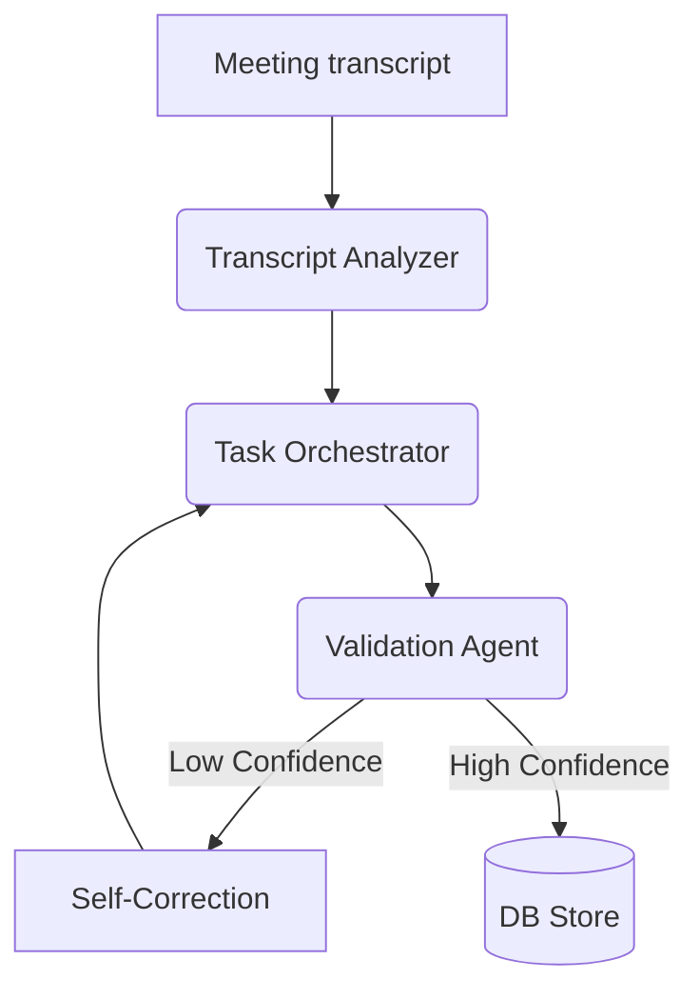

# WorkSyncAI ⚡️
**AI-Powered Workspace Orchestration & Team Performance Intelligence**

WorkSyncAI transforms meeting transcripts into actionable tasks and evaluates developer performance through automated AI-driven GitHub PR reviews. Built for agile teams that need precision, accountability, and zero-friction execution loops.

## 🚀 Key Features

- **Live AI Transcription**: Real-time speech-to-text during meetings using standard Web Speech APIs.
- **Meeting to Action Flow**: Extracts actionable items from transcripts, assigns owners based on context, and creates tracked project tasks.
- **Ambiguity Detection**: The AI is programmed to ask for clarification rather than guessing when a task owner or requirement is ambiguous.
- **Automated Summaries**: Instantly emails a concise summary and list of action items to all meeting participants.
- **Automated PR Evaluation**: AI-driven code reviews that evaluate PR correctness, quality, and completeness against assigned tasks.
- **Manager Dashboard**: High-level visibility into team backlog, verified work, active sprints, and at-risk overdue tasks with automated escalation alerts.
- **Proactive AI Cron Jobs**: Automated background jobs detect SLA risks, send follow-up nudges, and escalate bottlenecks before they block the sprint.
- **Employee Hub**: Focused task views with integrated PR submission workflows.

## 🛠 Tech Stack

- **Framework**: [Next.js 16 (App Router)](https://nextjs.org/)
- **Authentication**: [Clerk](https://clerk.com/)
- **Database**: [Prisma](https://www.prisma.io/) with PostgreSQL
- **AI Engine**: [GROQ SDK](https://groq.com/) (Llama 3.3 models)
- **Video Conferencing**: [LiveKit](https://livekit.io/)
- **UI Components**: [Shadcn UI](https://ui.shadcn.com/) & [Tailwind CSS 4+](https://tailwindcss.com/)
- **Icons**: [Lucide React](https://lucide.dev/)

### SDLC, Delivery & Security Strategy
- **Edge Layer Protection**: `middleware.ts` encapsulates basic global rate limiting logic to guard API pathways.
- **Verification via Live Feedback**: Pull Request analyses are surfaced directly enforcing a tight feedback-refactor loop.
- **State Management**: Safe and strict execution paths are verified using structured agent orchestration in `Task Orchestrator`.

## 🏗 Multi-Agent Architecture

WorkSync AI uses a specialized **Multi-Agent Orchestration Layer** for high-precision task extraction and automated work verification.



> [!NOTE]
> For a deep-dive into our **Agent Roles**, **Impact Model**, and **Technical Decision Logs**, please see our [Submission Summary](/submission_summary.md).

## 📦 Getting Started

### 1. Clone the repository
```bash
git clone https://github.com/divysaxena24/WorkSync.git
cd WorkSync
```

### 2. Install dependencies
```bash
npm install
```

### 3. Environment Setup
Create a `.env.local` file in the root directory and add your keys:
```env
# Database
DATABASE_URL="your-postgresql-url"

# Clerk Auth
NEXT_PUBLIC_CLERK_PUBLISHABLE_KEY="your-clerk-pub-key"
CLERK_SECRET_KEY="your-clerk-secret-key"
NEXT_PUBLIC_CLERK_SIGN_IN_URL=/sign-in
NEXT_PUBLIC_CLERK_SIGN_UP_URL=/sign-up
NEXT_PUBLIC_CLERK_SIGN_IN_FORCE_REDIRECT_URL=/dashboard
NEXT_PUBLIC_CLERK_SIGN_UP_FORCE_REDIRECT_URL=/dashboard

# AI & External APIs
GROQ_API_KEY="your-groq-key"
GITHUB_TOKEN="your-github-personal-access-token"

# LiveKit (Video)
LIVEKIT_API_KEY="your-livekit-api-key"
LIVEKIT_API_SECRET="your-livekit-secret"
NEXT_PUBLIC_LIVEKIT_URL="your-livekit-ws-url"

# Resend (Email Notifications)
RESEND_API_KEY="your-resend-api-key"

# Vercel Cron
CRON_SECRET="your-cron-secret-string"
```

### 4. Database Initialization
```bash
npx prisma generate
npx prisma db push
```

### 5. Run Development Server
```bash
npm run dev
```
Navigate to `http://localhost:3000` to see the results.

## 🧪 Development Workflow

1.  **Sync**: Users log in and join/create a company.
2.  **Meeting**: Start a meeting, record audio.
3.  **Meeting to Action**: The AI extracts tasks, automatically assigns owners, flags ambiguities without guessing, creates tasks in the system, and emails a summary to everyone.
4.  **Execute & Nudge**: Teams execute work. Meanwhile, AI cron jobs proactively track velocity and send follow-ups.
5.  **Evaluate**: Submit GitHub PR numbers to get instant feedback and score updates on the dashboard.

## 📄 License
Precision built for high-performance teams. Under MIT License. © 2026 WorkSyncAI.
