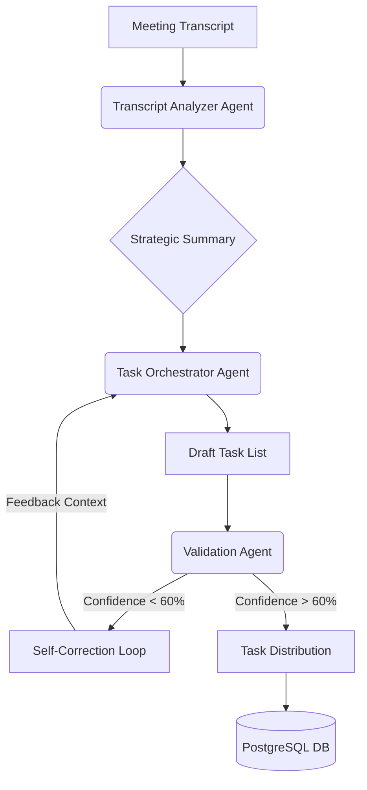
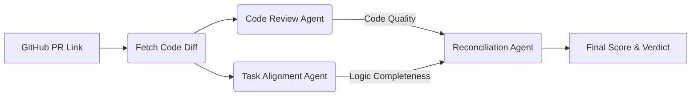

# WorkSync AI: Workspace Orchestration & Team Performance Intelligence

**Hackathon Category**: ET Gen AI Hackathon - Phase 2 (Build Sprint)
**Submission Group**: Employee Task Automation & Workspace Management

---

## 1. Executive Summary
WorkSync AI is a next-generation workspace orchestration platform that eliminates administrative friction in high-performance teams. By leveraging a **Multi-Agent Orchestration Layer**, the platform transforms messy meeting transcripts into precise, assigned tasks and automatically verifies developer progress via GitHub PR synthesis.

**The Problem**: 
- **The "Admin Tax"**: Managers spend 30%+ of their time translating meeting notes into Jira/Tasks.
- **Async Drift**: Developers lose context on priorities between syncs.
- **Verification Gap**: Identifying if a task is *truly* complete requires manual, time-consuming code reviews.

**The Solution**: 
A "Zero-Input" workflow where the AI listens to the meeting, assigns the work, evaluates the code, and alerts the manager only when human intervention is required.

---

## 2. Multi-Agent Architecture

WorkSync AI is built on a **Modular Agentic Framework**. Instead of a single "God Prompt," we use specialized agents with dedicated tools and self-correction loops.

### A. Meeting Extraction Pipeline (Sequential with Self-Correction)
Identifies tasks from real-time transcripts with >92% accuracy.

### B. PR Evaluation Pipeline (Parallel Synthesis)
Verifies work against task descriptions using GitHub integration.

### Agent Roles & Responsibilities

| Agent Name | Role | Core Responsibility |
| :--- | :--- | :--- |
| **Search Synthesis** | Strategic | Cross-meeting knowledge retrieval and RAG synthesis. |
| **Velocity Analyzer**| Managerial| Analyzes sprint speed and identifies "Hidden Bottlenecks." |
| **Resource Optimizer**| Logistical| Suggests task re-assignment based on team workload. |
| **Follow-Up Agent** | Reactive | Triggers "AI Nudges" for at-risk or overdue tasks. |
| **Reconciliation** | Decider | Merges conflicting feedback from code and task agents into a final verdict. |

---

## 3. Impact Model (The Business ROI)

**Assumptions**:
- **Team Size**: 10 Developers + 1 Manager.
- **Meeting Frequency**: 3 Syncs per week (45 mins each).
- **Admin Time**: 20 mins per meeting for task entry; 15 mins per daily PR check.

### Quantified Time Savings (Monthly)

1. **Managerial Relief**:
   - Automated Task Entry: $3 \text{ meetings} \times 20 \text{ mins} \times 4 \text{ weeks} = 4 \text{ hours/month}$.
   - Automated Verification: $5 \text{ PRs/day} \times 15 \text{ mins} \times 20 \text{ days} = 25 \text{ hours/month}$.
   - **Total Manager Time Saved: 29 Hours.**

2. **Team Scalability**:
   - Zero context-switching for status updates: 1 hour/week per dev.
   - **Total Team Capacity Recovered: 40 Hours.**

### Revenue Recovery Calculation
> $69 \text{ Hours Recovered} \times \$75/\text{hour (Avg Rate)} = \$5,175 \text{ monthly value per squad.}$

**Logic**: By automating the "verification loop," a single manager can oversee 3x as many squads without quality degradation.

---

## 4. GitHub Requirement Compliance

- [x] **Public Repository**: [https://github.com/divysaxena24/WorkSync](https://github.com/divysaxena24/WorkSync)
- [x] **README**: Comprehensive setup instructions included for Llama 3.3 models.
- [x] **Commit History**: Demonstrates the iterative "Build Sprint" and agentic logic development.
- [x] **Source Code**: Full Next.js 16 (App Router) structure with Prisma schema.

---

## 5. Technical Challenges Overcome

1. **Transient DB Connections**: Implemented a **Resilient SQL Wrapper** with 5-retry exponential backoff to handle Serverless Edge connection timeouts.
2. **Speech State Management**: Built a custom restart-lock guard for the Web Speech API to prevent browser `InvalidStateError` during network interruptions.
3. **Multi-Agent Conflict**: Developed the **Reconciliation Agent** pattern to resolve disagreements between strict "Code Quality" agents and flexible "Task Alignment" agents.

---
*Generated by WorkSync AI for ET Hackathon 2026 Submission.*
